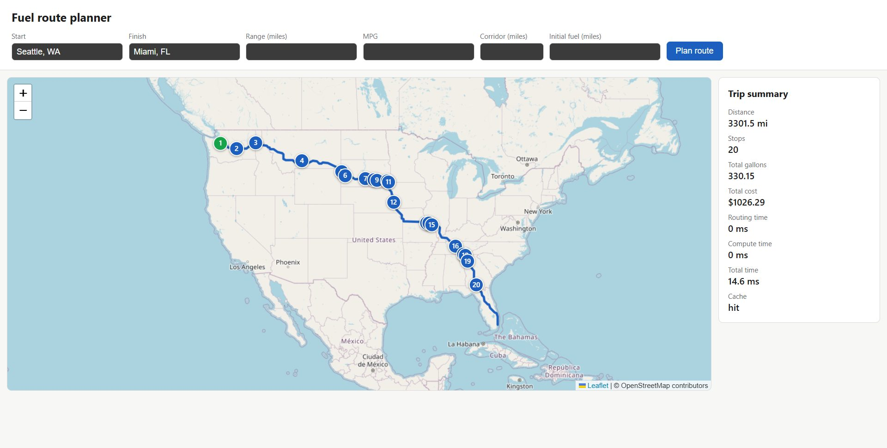
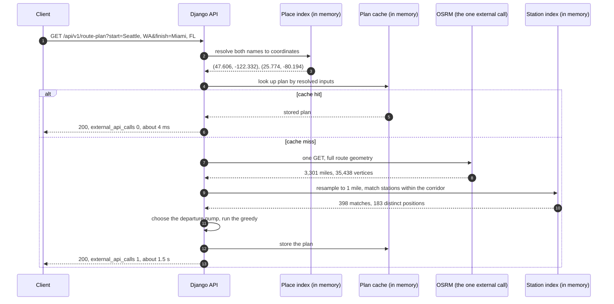

# Fuel Route Optimizer

[](https://github.com/SarthakB11/fuel-route-optimizer/actions/workflows/ci.yml)
[](https://www.python.org/downloads/)
[](https://www.djangoproject.com/)
[](LICENSE)

A Django API that plans a driving route between two US locations and works out the
cheapest way to fuel a 500 mile vehicle along it.

Give it a start and a finish. It returns the route geometry, an ordered list of the
truck stops to buy fuel at, how many gallons to buy at each one, and what the trip
costs in total at 10 miles per gallon.

```
GET /api/v1/route-plan?start=Seattle,%20WA&finish=Miami,%20FL
```

```jsonc
{
  "map_url":   "http://127.0.0.1:8000/map?start=Seattle%2C+WA&finish=Miami%2C+FL",
  "fuel_plan": { "stop_count": 20, "total_gallons": 330.15, "total_cost_usd": 1026.29, "stops": [ ... ] },
  "route":     { "provider": "OSRM", "distance_miles": 3301.5, "geometry_vertices": 3396, "source_vertices": 35438, "geometry": { "type": "LineString", ... } },
  "performance": { "total_ms": 1857.46, "routing_ms": 1613.12, "compute_ms": 53.31, "external_api_calls": 1 }
}
```

There is also a browser map at `/map?start=Seattle,%20WA&finish=Miami,%20FL` that draws
the route and the stops:



The green pin is the departure fill up. Every other pin is numbered in the order the
stops are made, and clicking one shows the station, the price, the gallons bought
and the cost.

## Where it comes from

At BeatRoute I have worked on territory cutting: dividing a sales geography into beats
and routes that field teams can actually drive, which is a routing problem over a road
network with an optimisation layered on top of it. This project is a standalone
exploration of a neighbouring shape of that problem, where the optimisation runs along
one route rather than across a territory, and where the constraints are sharp enough
to state in a line: call the routing provider once, and answer fast. It is built
entirely on public data and a public routing service, and shares no code or data with
that work.

## What makes this interesting

The project sets itself two hard constraints, and everything in the design follows from
them: call the routing service **once** per request, and be **fast**. This is what one
request does, and where the one external call sits:



- **One external call per request.** The route geometry comes from a single OSRM
  request. Place names are resolved against a local index rather than a geocoding
  service, and the fuel stop search runs entirely in memory, so a normal request makes
  exactly one outbound HTTP call. The response reports the real count in
  `performance.external_api_calls`, and a cache hit reports zero.
- **The price file has no coordinates.** It lists 8151 truck stops by city and state
  only. Geocoding those at request time would mean thousands of calls to a free
  geocoder, so it happens once, offline, in `scripts/build_dataset.py`, and the result
  is committed. The runtime never geocodes a station.
- **Picking stops is a real optimisation.** A 500 mile tank cannot cross the country in
  fewer than seven fills, and the cheapest plan is not "stop at the nearest station when
  the tank runs low": on Seattle to Miami the optimiser buys 1.3 gallons at one station
  purely to reach a cheaper one, and fills the tank outright at the cheapest station on
  the route. It comes in at $1,026 against $1,102 for the same fuel bought at the
  average price of the stations actually on that route, and the test suite checks the
  result against an exact dynamic program on randomised instances rather than trusting
  that it looks reasonable.

## Quick start

Requires Python 3.12 or newer.

```bash
git clone https://github.com/SarthakB11/fuel-route-optimizer.git
cd fuel-route-optimizer

python3 -m venv .venv
source .venv/bin/activate          # Windows: .venv\Scripts\activate
pip install -r requirements.txt

python manage.py runserver
```

Then open <http://127.0.0.1:8000/map> in a browser, or:

```bash
curl "http://127.0.0.1:8000/api/v1/route-plan?start=Denver,+CO&finish=Chicago,+IL"
```

No database to create, no migrations to run, no API key to obtain. The station dataset
is committed, so a clean checkout works immediately. That claim was checked rather than
assumed: the steps above were run verbatim from a fresh clone on Linux with Python 3.12
and on Windows with Python 3.13, and the Postman collection was run against the result
with newman, nine requests and eight assertions, all passing.

### Or with Docker

```bash
docker compose up --build
curl "http://127.0.0.1:8000/api/v1/route-plan?start=Denver,+CO&finish=Chicago,+IL"
```

One service, no database container, no volume. The image runs gunicorn with two
workers as a non root user on `python:3.12-slim`, and it needs no environment
variables at all: the defaults are the same ones `runserver` uses. CI builds the image
on every push so a broken Dockerfile cannot land.

Configuration is optional and lives in environment variables. `.env.example` lists
every variable with its default; export the ones you want to change, or load the file
with your own tooling. Nothing in the project reads a `.env` file automatically, so
there is no hidden configuration step.

## The API

### `GET /api/v1/route-plan`

| Parameter            | Default      | Meaning                                                                                                                                                                                                                                   |
| -------------------- | ------------ | ----------------------------------------------------------------------------------------------------------------------------------------------------------------------------------------------------------------------------------------- |
| `start`              | required     | Origin. `"Denver, CO"`, `"Denver, Colorado"`, `"Denver Colorado"` or `"39.7392,-104.9903"`. A bare `"Denver"` also works when one namesake dominates by population; `"Springfield"` does not, and the 400 names the states to choose from |
| `finish`             | required     | Destination, same formats                                                                                                                                                                                                                 |
| `range_miles`        | 500          | How far the vehicle goes on a full tank                                                                                                                                                                                                   |
| `mpg`                | 10           | Miles per gallon                                                                                                                                                                                                                          |
| `corridor_miles`     | 12           | How far off the route a station may sit to count                                                                                                                                                                                          |
| `initial_fuel_miles` | 0            | Miles of fuel already in the tank at the origin                                                                                                                                                                                           |
| `geometry`           | `simplified` | `simplified` thins the returned route line, `full` returns every vertex the routing provider sent                                                                                                                                         |

The response has six blocks: `request` with the resolved inputs, `map_url` linking to
the browser map for the same trip, `fuel_plan` with the ordered stops and the totals,
`route` with the provider, distance, duration and GeoJSON geometry, `assumptions` in
plain English, and `performance` with the timings and the external call count.

`fuel_plan` deliberately comes before `route`. The geometry runs to thousands of
coordinates, and putting it first would bury the answer for anyone reading the raw body
in a browser.

`geometry` decides how much of the route line comes back. OSRM answers Seattle to Miami
with 35,438 vertices, one every 500 feet, which is 831 KB of JSON to draw a line no
screen resolves to that detail. The default runs Douglas-Peucker over it at a tolerance
of 0.02 miles, about 30 metres, which leaves 3,396 vertices in an 88 KB body: no vertex
OSRM sent lies further than that tolerance from the line returned, which is invisible at
any zoom the map page offers. `route.geometry_vertices` and `route.source_vertices`
report both counts on every response, so the thinning is never silent, and
`assumptions.simplification` states the tolerance.

The plan does not depend on that choice. Station matching runs on the full polyline
resampled to one point per mile, before anything is dropped, so `geometry=simplified`
and `geometry=full` return the same stops at the same offsets for the same price. A
test asserts exactly that. Pass `geometry=full` when you want the provider's own
vertices.

`map_url` is an absolute link to `/map` carrying the query parameters the caller sent,
so "return a map of the route" is answered by a URL in the body rather than by a page
the caller has to assemble from the parameters they just typed.

`request.start.snapped_to_road_miles` and `request.finish.snapped_to_road_miles` report
how far the routing provider had to move each point to put it on a road. A pair of
coordinates in the Pacific is answered with a perfectly good route from the nearest
coast road, and this is the only thing in the response that says so: 142.7 miles, in
that case. Above five miles the response also carries an `assumptions.snapped_endpoint`
line naming the endpoint and the distance, because past that the plan answers a
different question than the one that was asked.

Each stop reports the station, its coordinates, how far along the route it is
(`offset_miles`) and how far the vehicle drives to reach it from the previous stop
(`leg_miles`), how far off the route it sits, the price, the gallons to buy, the cost,
and the running total.

Errors return `{"error": ..., "detail": ...}`:

| Status | When                                                                                                                            |
| ------ | ------------------------------------------------------------------------------------------------------------------------------- |
| 400    | A bad parameter, or a place that cannot be resolved or is ambiguous                                                             |
| 422    | The trip cannot be driven: no road route between the points, no station within the corridor, or a gap wider than the tank range |
| 502    | The routing provider itself failed                                                                                              |

A 422 for an empty corridor says which kind of empty it is. If widening
`corridor_miles` would find stations, the message says how many lie within the 50 mile
maximum. If nothing lies within 50 miles of any point on the route, as on San Francisco
to Sacramento, it says so plainly rather than offering advice that cannot work.

The distinction between 422 and 502 is deliberate. Asking for Los Angeles to Honolulu
is not a provider outage, it is a trip that cannot be driven, and the caller should not
go looking for a fault that is not there. `DEBUG` defaults to off so an unmapped
exception cannot return an HTML traceback to an API caller.

### `GET /api/v1/health`

Station count, dataset generation timestamp, version.

### `GET /map`

A Leaflet page that calls the API and draws the route, the numbered stops and the
totals. Takes the same query parameters.

## Routing provider, and why

**OSRM's public demo server**, `https://router.project-osrm.org`. It is free, needs no
API key or account, and returns the complete route geometry, distance and duration in
a single request. That last point is what matters here: the whole per request budget is
one call, and OSRM fits in it.

OpenRouteService was the alternative and does the same job, but it requires a free API
key, which puts a credential in the path of anyone trying to run the project from a
clean checkout, for no benefit.

`OSRM_BASE_URL` is read from the environment, so pointing at a self hosted OSRM
instance is a configuration change, not a code change. The public demo server is best
effort and rate limited, which is a good reason to run your own for anything serious.

## How the fuel stops are chosen

The tank is empty at the origin, so the vehicle fuels before setting off. Every mile of
the trip is paid for and the tank arrives empty, so total gallons is exactly the trip
distance divided by mpg. What the optimiser decides is **where those gallons are
bought**.

Treat the destination as a pump whose fuel is free, and the rule is one sentence:

> At each stop, if a cheaper pump is reachable on a full tank, buy just enough fuel to
> reach it. Otherwise fill the tank and drive to the cheapest pump in range.

It is optimal by an exchange argument: any gallon bought at one price while a cheaper
pump was still reachable could have been bought at the cheaper pump instead, for the
same journey and less money.

The subtlety worth knowing about is clause order. Checking "can I reach the
destination?" before "is there a cheaper pump on the way?" is the natural way to write
it, and it is wrong. With pumps at mile 0 at $4.42 and mile 100 at $3.01 on a 120 mile
trip, finishing straight from the origin costs $53.04 while stopping at the cheaper
pump costs $50.22. That case is a regression test.

`docs/DESIGN.md` has the full argument, the complexity analysis, and the record of what
the exact dynamic program caught when the first version of this was written.

One property of minimising dollars and nothing else is worth knowing about before you
read a plan. Because stopping is free in this model, the optimiser is happy to make
many small purchases: on the Seattle to Miami route it buys 1.3 gallons at one station
purely to reach a cheaper one 13 miles later, then fills the tank there. That is
genuinely the cheapest plan, and cheapest is what this project optimises for, but a real driver
also values their time. Adding a fixed penalty per stop and preferring the plan with
the lowest combined cost would consolidate those, and the greedy would need to become
a small dynamic program to stay optimal. That is a deliberate non goal here.

## Performance

The routing call dominates, which is exactly why it happens once and gets cached.

Measured on Seattle to Miami, 3,301 miles, 35,438 geometry vertices from OSRM, 398
stations matched inside the corridor which collapse to 183 distinct positions, 20 fuel
stops:

| Stage                                                                          | Time                                |
| ------------------------------------------------------------------------------ | ----------------------------------- |
| OSRM routing call                                                              | 1,200 to 1,600 ms                   |
| Local work with `geometry=full`: resample, match stations, optimise, serialise | 73 ms                               |
| Local work by default, which adds thinning 35,438 vertices to 3,396            | 174 ms                              |
| **Total, cold**                                                                | **1,300 to 1,900 ms**               |
| **Total, cached repeat**                                                       | **4 to 10 ms, zero external calls** |

Los Angeles to New York, 2,793 miles, has the same shape: about 52 ms of local work on
top of whatever the routing call costs.

The routing call is roughly 96 percent of a cold request. It is also the only part not
under this service's control, and it is the part that moves: the figures above are a
range over repeated runs against the public demo server from one location, so treat
them as indicative rather than as a benchmark. That variance is itself the argument for
making the call once and caching the result.

The number that is stable, and the one this project can fairly be judged on, is the
local work. Resampling a 35,000 vertex polyline, matching 6,626 stations against it,
choosing 20 fuel stops and serialising the response is about 73 ms, and it stays in
that region whether the route is 600 miles or 3,300.

Thinning the geometry is the one piece of local work that is not close to free.
Douglas-Peucker over OSRM's 35,438 vertices costs about 100 ms, so Seattle to Miami
does 174 ms of local work by default against 73 ms with `geometry=full`. What it buys
is a body 9.4 times smaller, 88 KB against 831 KB, or 32 KB against 258 KB once
gzipped: three quarters of a megabyte the browser does not have to receive, parse and
hand to Leaflet. The routing call is still several times either figure, so the trade
is 100 ms of server CPU against the wire, and a caller who would rather have the CPU
back can ask for `geometry=full`. A cached repeat answers in under 10 ms either way,
having made no external call at all.

Six identical requests arriving at once make one routing call, not six. A miss takes a
per key lock before it calls the provider, so concurrent callers for the same trip
wait for the first and then read its result from the cache.

Station matching avoids the obvious quadratic trap. Comparing every station to every
one of OSRM's 34,000 geometry vertices would be 225 million distance calculations. The
polyline is resampled to about one point per mile and those points go into a uniform
latitude and longitude grid, so each station needs one lookup against a 3x3 block of
cells. That makes the work proportional to stations plus route points rather than their
product.

The 6,626 station table is parsed once per process at startup, about 20 ms, and held in
memory. Plans are memoised in Django's cache keyed on the resolved inputs.

## The dataset

`data/truckstop-fuel-prices.csv` is the source price list, a snapshot of posted truck
stop diesel prices by stop, committed unmodified for provenance. `scripts/build_dataset.py` turns it into
`data/stations.json`:

- drops 620 Canadian rows, since both endpoints must be in the USA
- deduplicates 7531 rows into 6626 stops, keeping the lowest posted price per stop
- geocodes every stop by joining city and state against the GeoNames populated place
  gazetteer, in four tiers: exact name (6581), name with spaces removed (24), GeoNames
  alternate name (14), and a hand checked override table (7)

Nothing is left unresolved and the script exits non zero if anything ever is, so a
future price file cannot quietly lose stations. Stations are placed at their city
centroid rather than the exact highway exit, which the corridor width absorbs; detour
distances are reported but not added to the miles driven. Stations in the same town
share that centroid, so only the cheapest of any group at an identical point is kept:
a dearer station in the same place can never appear in a cheapest plan.

### Where the price file has no coverage

The price file is a snapshot of one pricing feed, not a census of US fuel stops,
and its coverage is uneven in ways worth knowing before reading a 422:

- **California has 8 stations**, all in the Imperial and Coachella valleys near the
  southeastern border. Interstate 5 has none, so Portland to San Diego reports that it
  cannot be completed, and Los Angeles to New York takes its departure fuel at a
  station in Jean, Nevada, 239 miles along the route. The response says so in
  `origin_price_source` rather than hiding it.
- **Alaska, Hawaii and DC have none at all**, and Rhode Island has two.
- Coverage is dense across the interstate corridors of the Midwest, the South and
  Texas, which is where a truck stop pricing feed would be expected to concentrate.

To make that concrete, here is the widest gap between consecutive stations on the
major corridors, measured by routing each one and matching the file against it at the
default 12 mile corridor. Anything under 500 miles completes on the default tank.

| Corridor                         | Miles | Widest gap  | Result                                  |
| -------------------------------- | ----- | ----------- | --------------------------------------- |
| I-90 Seattle to Boston           | 3,040 | 216         | completes                               |
| I-94 Billings to Detroit         | 1,512 | 217         | completes                               |
| I-80 Salt Lake City to Chicago   | 1,401 | 92          | completes                               |
| I-70 Denver to Baltimore         | 1,681 | 55          | completes                               |
| I-95 Boston to Miami             | 1,491 | 46          | completes                               |
| I-35 Duluth to Laredo            | 1,558 | 53          | completes                               |
| I-10 Los Angeles to Jacksonville | 2,417 | 148         | completes, departs via Nevada           |
| I-40 Los Angeles to Nashville    | 2,007 | 96          | completes, departs via Nevada           |
| I-80 San Francisco to New York   | 2,911 | 94          | completes, departs via Nevada           |
| US-50 Reno to Salt Lake City     | 519   | 95          | completes                               |
| I-5 Seattle to Portland          | 173   | 37          | completes                               |
| I-5 Seattle to San Diego         | 1,255 | 997         | cannot: no station on I-5 in California |
| I-5 Sacramento to Los Angeles    | 384   | no stations | cannot: nothing within 12 miles         |
| Las Vegas to San Francisco       | 568   | 537         | cannot: no station past the Nevada line |

Every failure is a California gap in the source file. Everywhere else, the widest gap
on any interstate is 217 miles, well inside the tank.

At the other extreme, a trip shorter than the corridor is wide is still a trip. Every
station near a route that short projects onto its final point, and the offsets are
measured along the resampled polyline, whose length sits a few hundred thousandths of a
mile either side of the road distance the provider reports. Half a mile across
downtown Denver plans one fill up of 0.049 gallons for sixteen cents.

These are properties of the data, not of the service. When a trip cannot be
completed, the 422 names the last station reached, the next one on the route, and the
distance between them, so the cause is obvious from the message alone.

To rebuild from scratch, which downloads the GeoNames US gazetteer:

```bash
python scripts/build_dataset.py
```

## Tests

```bash
pip install -r requirements-dev.txt
pytest
```

Every test runs offline and deterministically. The routing provider is mocked at the
session boundary, and no test touches the network. Coverage is 97 percent and CI fails
below 95; `mypy` runs over the whole package in CI and is clean, and it earned its
place by catching two real call site mismatches while the code was being written.

The suite covers the geometry helpers against known distances, the grid index against a
brute force scan, the routing client's parsing and its failure modes, place resolution,
the dataset's integrity, and the API's status codes and response shape. Two of them
carry most of the weight:

- **the greedy against an exact dynamic program** on randomised instances, which is the
  real proof that the optimiser is correct rather than merely plausible. The same check
  was also run outside the suite on 25 real routes between large US cities, with the
  actual OSRM geometry, the actual station matches and the actual prices: the greedy
  matched the exact optimum to the cent on every one
- **an assertion that the routing mock is called exactly once** on a cold request and
  exactly zero times on a repeat, which pins the constraint the whole design exists to
  satisfy

## Layout

```
config/                 Django project: settings, URLs, WSGI and ASGI entry points
fuelroute/
  geo.py                haversine, polyline resampling, the route point grid index
  stations.py           station records, the loader, corridor matching
  places.py             local place name to coordinate resolution
  routing.py            the OSRM client, one call per route
  optimizer.py          the fuel stop greedy
  planner.py            orchestration: resolve, route, match, optimise, cache
  views.py              thin DRF views
  serializers.py        input validation and response shaping
  tests/                offline test suite, including the dynamic program reference
scripts/build_dataset.py  the offline geocoding build step
data/                   the price file and the generated station and place indexes
postman/                importable collection with worked examples
docs/DESIGN.md          decisions, trade offs, and what the tests caught
```

## Licence

MIT. See `LICENSE`.
